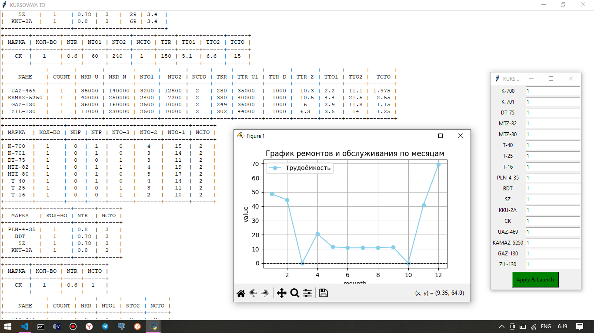
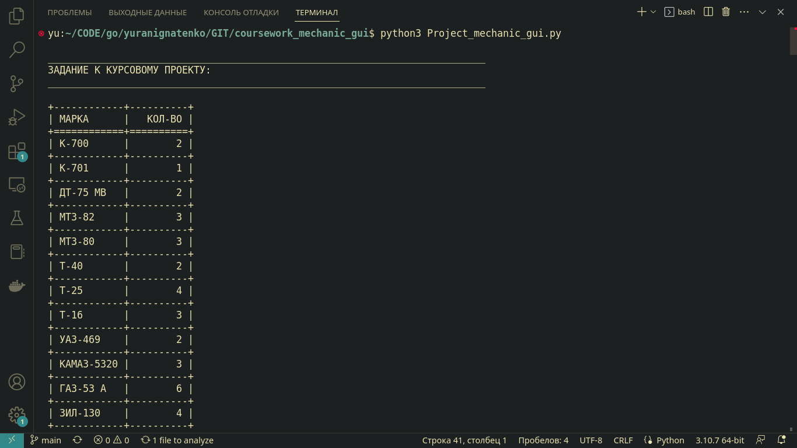
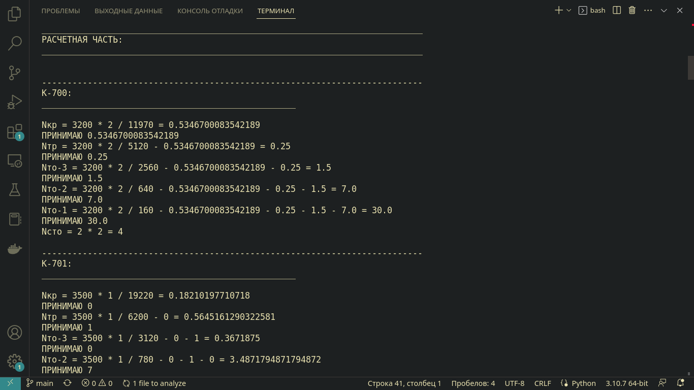
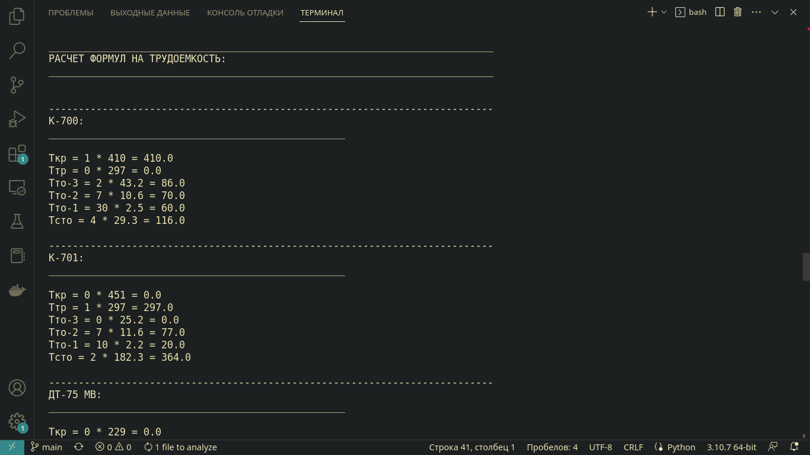

# coursework_mechanic_gui

```
Данная программа предоставляет возожность
в автоматическом режиме произвести расчеты
трудоёмкости / часов при ремонтах
разнообразного машинно-тракторного парка
к примеру таких как:

К-700
ДТ-75
МТЗ-80
МТЗ-82
ГАЗ-53
ЗИЛ-130

а также прочих борон, картофелесажалки, комбайнов и прочего.
```

> Demo screen





